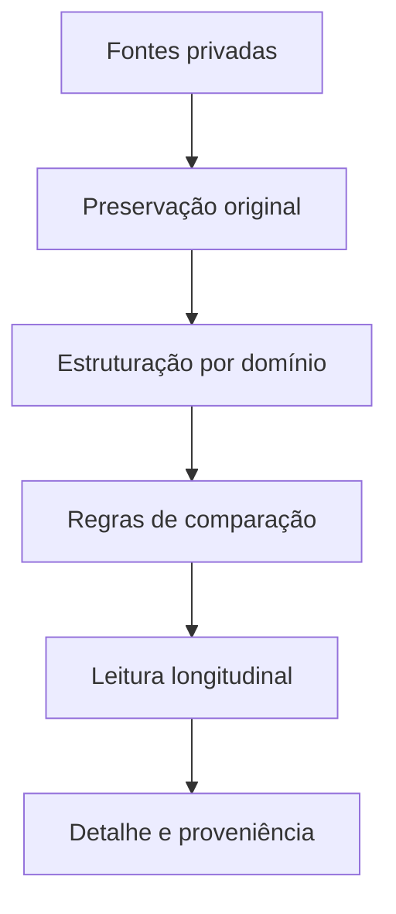

# LTS Health — arquitetura canônica de produto

Status: fonte de verdade de produto. Este documento registra o que o LTS Health precisa resolver, como as áreas se relacionam e quais perguntas cada tela deve responder. Não contém dados pessoais de saúde.

## Tese do produto

O LTS Health é um **assistente longitudinal privado de saúde**, apoiado por evidências registradas. Ele reúne fontes fragmentadas, preserva a origem de cada dado e transforma o histórico em uma leitura simples:

1. o que está documentado agora;
2. o que mudou no período;
3. quão completa e confiável é essa leitura;
4. onde aprofundar ou completar dados.

O usuário não deve precisar conhecer arquivos, parsers, tabelas ou regras internas para obter essa resposta. Nutricionista, treinador e profissional de saúde autorizado devem conseguir chegar à evidência original sem perder o contexto longitudinal.

## O que o produto não é

- uma coleção de cards independentes;
- um repositório de arquivos apresentado como dashboard;
- uma planilha que transfere ao usuário a revisão técnica de dados;
- um sistema que preenche lacunas, combina origens ou atribui causalidade por suposição;
- uma ferramenta de diagnóstico, prescrição, meta corporal ou julgamento estético.

## Perguntas que orientam a experiência

Toda informação visível deve responder pelo menos uma destas perguntas:

| Pergunta | Resposta esperada |
| --- | --- |
| Como está o histórico conhecido? | Último estado documentado por domínio, com data e origem quando relevantes. |
| O que mudou? | Comparação entre pontos compatíveis ou indicação clara de que não há comparação segura. |
| Essa leitura é completa? | Cobertura, ambiguidade, falha ou ausência sem transformar lacuna em zero. |
| O que merece revisão? | Poucas prioridades explicadas em linguagem comum, com ação direta. |
| De onde veio? | Caminho curto até fonte, registro e evidência preservada. |

## Arquitetura de informação

### Navegação primária

| Grupo | Área | Trabalho principal |
| --- | --- | --- |
| Acompanhar | Visão geral | Entender estado, mudança, cobertura e prioridades da janela. |
| Acompanhar | Timeline | Percorrer eventos de todos os domínios em ordem temporal. |
| Áreas | Treinos | Ir de ritmo e progressão para sessão, exercício e série. |
| Áreas | Composição | Comparar medições compatíveis e abrir detalhe corporal/segmentar. |
| Áreas | Nutrição | Ver cobertura e histórico registrado, incluindo hidratação. |
| Áreas | Exames | Explorar coletas e séries comparáveis por marcador, origem e unidade. |
| Contexto | Recuperação e análises | Ler sono, atividade e relações temporais sem confundir associação com causa. |
| Contexto | Protocolos | Consultar contexto histórico sem inferir situação atual ou orientar uso. |
| Sistema | Dados e fontes | Conectar, importar, acompanhar processamento, qualidade e backup. |

`Evolução` deixa de ser uma seção primária concorrente. Suas capacidades pertencem a Composição e Treinos; a rota antiga continua funcional durante a transição para preservar links.

### Hierarquia da Visão geral

A abertura deve ser uma superfície de decisão, nesta ordem:

1. **Cabeçalho e janela:** título, explicação curta e filtro global.
2. **Estado por domínio:** cinco resumos de Composição, Treinos, Nutrição, Recuperação e Exames.
3. **Tendência principal:** um único gráfico longitudinal, alternável entre métricas, ao lado da síntese da janela.
4. **Acontecimentos recentes:** uma linha temporal curta que conecta os domínios sem repetir seus detalhes.
5. **Cobertura:** somente lacunas que realmente limitam a leitura, com acesso à gestão de fontes.

A primeira tela não deve apresentar todos os elementos com o mesmo peso nem empilhar mini-dashboards por domínio. O gráfico principal vem cedo; o detalhe fica nas áreas especializadas.

## Contrato de cada área

Cada tela especializada segue a mesma progressão:

1. **Resumo:** estado conhecido e período aplicado.
2. **Mudança:** diferença segura, ou motivo objetivo para não comparar.
3. **Tendência:** série temporal apenas quando datas, unidades e origens forem compatíveis.
4. **Detalhe:** registro e proveniência.
5. **Cobertura:** ausências, conflitos e falhas separados de valores reais.

## Modelo mental dos dados

- A fonte original nunca é substituída pelo resumo.
- Uma linha estruturada só participa de comparação quando passa pelas regras do domínio.
- Evidência complementar pode enriquecer um evento, mas não cria duplicação automática.
- Ambiguidade, ausência e falha são estados diferentes e permanecem visíveis.

## Estados de interface

| Estado | Linguagem do produto | Regra |
| --- | --- | --- |
| Carregando | “Carregando esta área” | Não apagar dados já disponíveis. |
| Disponível | Valor + data/contexto | Mostrar somente evidência autorizada. |
| Parcial | “Parte dos dados não carregou” | Preservar o restante da área. |
| Ausente | “Sem registro” | Nunca renderizar zero implícito. |
| Ambíguo | “Revisão necessária” | Não escolher automaticamente um candidato. |
| Bloqueado | Próxima ação e motivo | Distinguir ação humana de dependência externa. |

## Princípios de UX

- linguagem de usuário, sem jargão de implementação;
- texto principal com pelo menos 16 px e rótulos regulares com pelo menos 14 px;
- ações específicas, como “Abrir treinos” ou “Revisar cobertura”, evitando repetição de “Ver mais”;
- navegação agrupada por intenção, sem áreas redundantes competindo pelo mesmo trabalho;
- desktop com rail escuro e canvas claro; mobile com conteúdo claro e navegação que não cobre a página;
- cor comunica domínio ou estado, não decoração;
- vazios explicam o que falta e oferecem uma ação somente quando ela existe;
- nenhum fluxo histórico exige digitação dia a dia quando uma transferência em lote é tecnicamente possível.

## Critério de produto concluído

Um pacote só pode ser chamado de concluído quando reúne quatro evidências diferentes:

1. aderência a esta arquitetura e ao `FEEDBACK_LEDGER.md`;
2. comportamento e dados protegidos por contratos automatizados;
3. inspeção visual real em desktop e celular;
4. confirmação de deploy público quando a interface publicada muda.

CI verde comprova regressões técnicas cobertas. Ele não comprova, isoladamente, que o produto corresponde ao briefing ou à referência visual.

## Referência visual e limitação atual

O histórico registra uma imagem aprovada em 04/09/2026 e o contrato textual correspondente em `REFERENCE_VISUAL_CONTRACT.md`. A imagem-fonte original não está preservada no repositório atual. Por isso:

- o contrato textual continua orientando a linguagem visual;
- nenhum pacote pode declarar paridade pixel a pixel sem recuperar e versionar a imagem-fonte;
- melhorias inequívocas de hierarquia, leitura, navegação, acessibilidade e estados continuam executáveis sem esse arquivo.

## Fontes usadas nesta consolidação

- histórico de decisões e feedbacks recuperado do projeto;
- `HANDOFF_LTS_HEALTH.md`, `MIGRATION_MANIFEST.md` e a implementação original fornecida;
- código, testes, migrations, issues e pull requests existentes;
- `PROJECT_BRIEF.md`, `PRODUCT_VISION_COCKPIT.md`, `REFERENCE_VISUAL_CONTRACT.md` e `DATA_AUDIT.md`.
